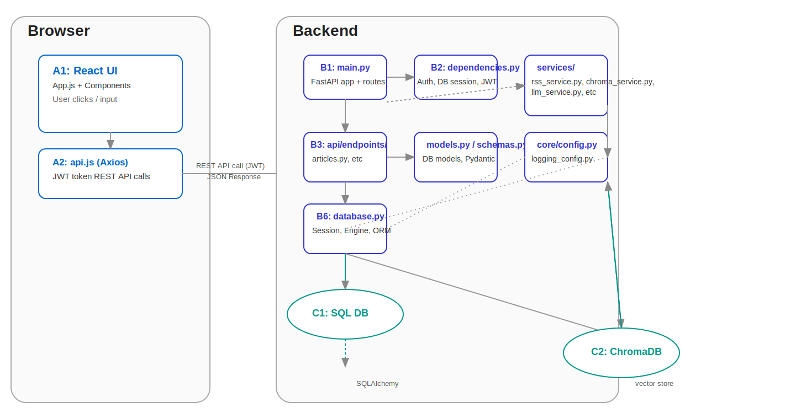

# GenAI Research Tool

A full-stack web application for research teams to aggregate, analyze, and synthesize AI and business-related articles from multiple sources. This tool helps manage sources, filter and categorize articles, track review status, and build AI-powered presentations from curated content.



## 🌟 Features

- **Multi-Source Aggregation**: RSS feeds, PDF uploads, and paid search APIs (Tavily, SERP)
- **AI-Powered Insights**: OpenAI GPT-4 integration for extracting key insights
- **Semantic Search**: ChromaDB vector database for intelligent article discovery
- **Article Management**: Filter, categorize, and track article status (new → reviewed → shortlisted → final)
- **Deck Builder**: Generate PowerPoint presentations from curated articles
- **User Authentication**: JWT-based secure authentication
- **Dashboard Analytics**: Track metrics and review progress

## 📋 Table of Contents

- [Prerequisites](#prerequisites)
- [Quick Start](#quick-start)
- [Local Development](#local-development)
- [Deployment](#deployment)
- [Environment Variables](#environment-variables)
- [API Documentation](#api-documentation)
- [Troubleshooting](#troubleshooting)

## 🔧 Prerequisites

- **Python 3.11+**
- **Node.js 22.x+** and npm
- **Git**
- API Keys (obtain these before starting):
  - OpenAI API key ([Get here](https://platform.openai.com/api-keys))
  - Tavily API key ([Get here](https://tavily.com/)) - Optional
  - SERP API key ([Get here](https://serpapi.com/)) - Optional
  - SlidesGPT API key ([Get here](https://slidesgpt.com/)) - Optional

## 🚀 Quick Start

### Option 1: Using Startup Scripts (Recommended for Local Development)

1. **Clone the repository**
   ```bash
   git clone <repository-url>
   cd research_tool_seethaV1
   ```

2. **Configure environment variables**
   ```bash
   # Backend configuration
   cp backend/.env.example backend/.env
   # Edit backend/.env and add your API keys

   # Frontend configuration
   cp .env.example .env
   ```

3. **Start the application**
   ```bash
   # Start both frontend and backend
   ./start-all.sh

   # Or start them separately in different terminals:
   ./start-backend.sh   # Terminal 1 - Backend on :8000
   ./start-frontend.sh  # Terminal 2 - Frontend on :3000
   ```

4. **Access the application**
   - Frontend: http://localhost:3000
   - Backend API: http://localhost:8000
   - API Docs: http://localhost:8000/docs

### Option 2: Using Docker Compose

1. **Clone and configure**
   ```bash
   git clone <repository-url>
   cd research_tool_seethaV1
   cp backend/.env.example backend/.env
   # Edit backend/.env with your API keys
   ```

2. **Start with Docker**
   ```bash
   docker-compose up --build
   ```

3. **Access the application**
   - Frontend: http://localhost
   - Backend API: http://localhost:8000

## 💻 Local Development

### Backend Setup

```bash
cd backend

# Create virtual environment (recommended)
python3 -m venv venv
source venv/bin/activate  # On Windows: venv\Scripts\activate

# Install dependencies
pip install --use-pep517 sgmllib3k==1.0.0  # Fix for feedparser dependency
pip install -r requirements.txt

# Configure environment
cp .env.example .env
# Edit .env and add your API keys

# Create necessary directories
mkdir -p uploads output static/decks chroma_db

# Run the backend
uvicorn app.main:app --reload --host 0.0.0.0 --port 8000
```

### Frontend Setup

```bash
# From project root
npm install

# Configure environment (optional, defaults work for local dev)
cp .env.example .env

# Start development server
npm start
```

## 🌐 Deployment

### Deploy to Railway.app (Recommended - Free Tier Available)

Railway offers $5/month credit which is enough to run this application for free.

#### Backend Deployment

1. **Create Railway account** at [railway.app](https://railway.app)

2. **Create new project** → Deploy from GitHub repo

3. **Configure environment variables** in Railway dashboard:
   ```
   SECRET_KEY=<generate-random-secret>
   OPENAI_API_KEY=<your-key>
   TAVILY_API_KEY=<your-key>
   SERP_API_KEY=<your-key>
   SLIDESGPT_API_KEY=<your-key>
   CORS_ORIGINS=https://your-frontend-url.railway.app
   ENVIRONMENT=production
   ```

4. **Set root directory** to `backend` in Railway settings

5. Railway will automatically:
   - Detect the Dockerfile
   - Build and deploy your backend
   - Provide a public URL (e.g., `https://your-app.railway.app`)

#### Frontend Deployment Options

**Option A: Vercel (Recommended for Frontend)**
1. Connect your GitHub repo to [Vercel](https://vercel.com)
2. Set environment variable:
   ```
   REACT_APP_API_BASE=https://your-backend.railway.app
   ```
3. Deploy (automatic)

**Option B: Railway (Full-Stack)**
1. Create separate Railway service for frontend
2. Use root directory as build path
3. Set build command: `npm run build`
4. Set start command: Served via nginx (Dockerfile handles this)

### Deploy to Render.com (Free Tier)

1. Create account at [render.com](https://render.com)
2. Create new **Web Service** → Connect repository
3. Settings:
   - **Build Command**: `cd backend && pip install -r requirements.txt`
   - **Start Command**: `cd backend && uvicorn app.main:app --host 0.0.0.0 --port $PORT`
4. Add environment variables (same as Railway)
5. Deploy

### Deploy to Fly.io

```bash
# Install flyctl
curl -L https://fly.io/install.sh | sh

# Login
flyctl auth login

# Launch backend
cd backend
flyctl launch

# Set environment variables
flyctl secrets set OPENAI_API_KEY=<your-key>
# ... set other secrets

# Deploy
flyctl deploy
```

### Docker Deployment (Any Cloud)

Build and push to any container registry:

```bash
# Build images
docker build -t genai-backend ./backend
docker build -t genai-frontend .

# Tag and push to your registry
docker tag genai-backend your-registry/genai-backend
docker push your-registry/genai-backend

# Deploy using your cloud provider's container service
# (AWS ECS, Google Cloud Run, Azure Container Instances, etc.)
```

## 🔐 Environment Variables

### Backend (.env in backend/)

| Variable | Required | Description | Default |
|----------|----------|-------------|---------|
| `SECRET_KEY` | Yes | JWT secret key (use strong random string) | - |
| `ALGORITHM` | No | JWT algorithm | HS256 |
| `OPENAI_API_KEY` | Yes | OpenAI API key for GPT-4 | - |
| `TAVILY_API_KEY` | No | Tavily search API key | - |
| `SERP_API_KEY` | No | SERP API key | - |
| `SLIDESGPT_API_KEY` | No | SlidesGPT API key | - |
| `LOG_LEVEL` | No | Logging level | INFO |
| `BACKEND_BASE` | No | Backend URL | http://localhost:8000 |
| `CORS_ORIGINS` | No | Allowed CORS origins (comma-separated) | http://localhost:3000 |
| `ENVIRONMENT` | No | Environment mode | development |

### Frontend (.env in root)

| Variable | Required | Description | Default |
|----------|----------|-------------|---------|
| `REACT_APP_API_BASE` | Yes | Backend API URL | http://localhost:8000 |

### Generating a Secure SECRET_KEY

```bash
# Python method
python -c "import secrets; print(secrets.token_urlsafe(32))"

# OpenSSL method
openssl rand -base64 32
```

## 📚 API Documentation

Once the backend is running, visit:
- **Swagger UI**: http://localhost:8000/docs
- **ReDoc**: http://localhost:8000/redoc

### Key API Endpoints

- `POST /auth/register` - Register new user
- `POST /auth/login` - Login and get JWT token
- `GET /sources/` - List all sources
- `POST /sources/` - Add new RSS/API source
- `POST /files/` - Upload PDF file
- `POST /sync/` - Sync all sources
- `GET /articles/` - Get articles (with filters)
- `PATCH /articles/{id}/status` - Update article status
- `POST /paid_search/` - Search using paid APIs
- `POST /deck/build-ppt` - Build PowerPoint deck
- `GET /dashboard/metrics` - Get dashboard metrics

## 🛠️ Troubleshooting

### Common Issues

#### 1. sgmllib3k Build Error

If you encounter build errors with sgmllib3k:

```bash
pip install --use-pep517 sgmllib3k==1.0.0
pip install -r requirements.txt
```

#### 2. CORS Errors

Make sure `CORS_ORIGINS` in backend/.env includes your frontend URL:

```env
# For local development
CORS_ORIGINS=http://localhost:3000,http://127.0.0.1:3000

# For production
CORS_ORIGINS=https://your-frontend-domain.com,http://localhost:3000
```

#### 3. Database Locked Error

SQLite doesn't handle concurrent writes well. For production, consider upgrading to PostgreSQL:

```python
# In backend/app/database.py
DATABASE_URL = os.getenv("DATABASE_URL", "sqlite:///./genai.db")
```

#### 4. ChromaDB Persistence Issues

Ensure the chroma_db directory exists and has write permissions:

```bash
mkdir -p backend/chroma_db
chmod 755 backend/chroma_db
```

#### 5. API Key Not Found

Double-check that:
1. `.env` file exists in `backend/` directory
2. Environment variables are properly formatted (no quotes needed)
3. No extra spaces around the `=` sign
4. Backend server was restarted after changing `.env`

### Getting Help

If you encounter issues:
1. Check the logs: `docker-compose logs backend` or terminal output
2. Verify all environment variables are set correctly
3. Ensure all API keys are valid and have sufficient quota
4. Check the [Issues](../../issues) page for known problems

## 🏗️ Architecture

### Tech Stack

**Frontend:**
- React 18.3.0
- Tailwind CSS 3.4.3
- Axios for API calls
- Lucide React for icons

**Backend:**
- FastAPI (Python)
- SQLAlchemy ORM
- SQLite database
- ChromaDB vector database
- OpenAI GPT-4 API
- JWT authentication

**Deployment:**
- Docker & Docker Compose
- Railway / Render / Fly.io compatible
- Nginx for frontend serving

### Data Flow

1. **Sources** → RSS feeds, PDFs, APIs → **Articles** (extracted & stored)
2. **Articles** → Categorized & filtered → **Review workflow**
3. **Final articles** → Selected for → **Deck Builder** → PowerPoint output
4. **ChromaDB** → Semantic search across all articles

## 📝 License

[Your License Here]

## 🤝 Contributing

Contributions are welcome! Please feel free to submit a Pull Request.

## 🔒 Security Notes

⚠️ **IMPORTANT**: Never commit API keys or secrets to version control!

- All secrets should be in `.env` files (which are gitignored)
- Rotate API keys if accidentally exposed
- Use strong SECRET_KEY for JWT tokens in production
- Enable HTTPS in production deployments
- Review CORS origins carefully for production

## 📧 Support

For support, please open an issue in the GitHub repository.

---

**Built with ❤️ for AI researchers and analysts**
